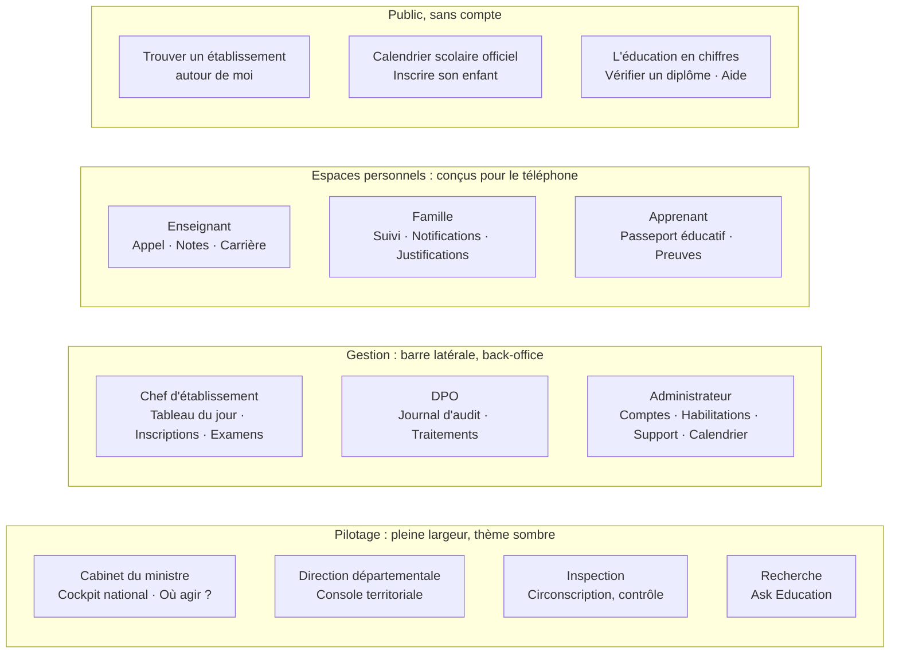
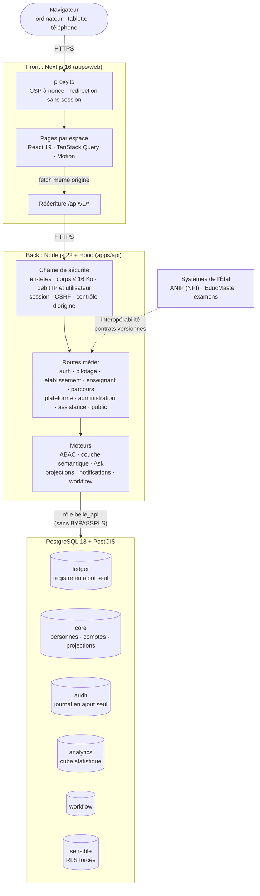
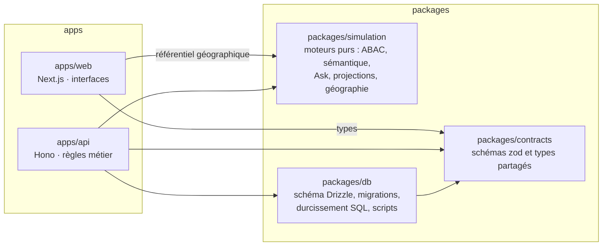
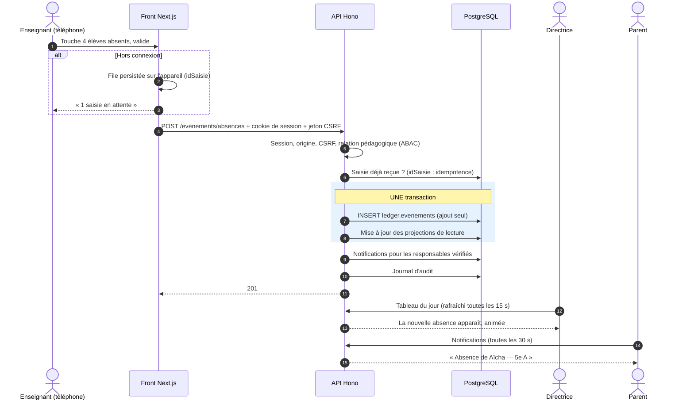
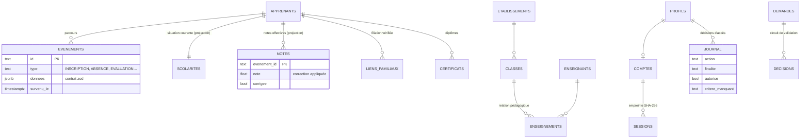
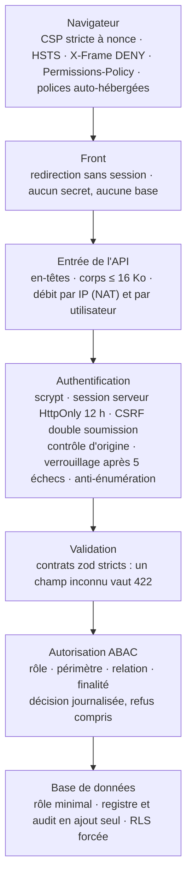
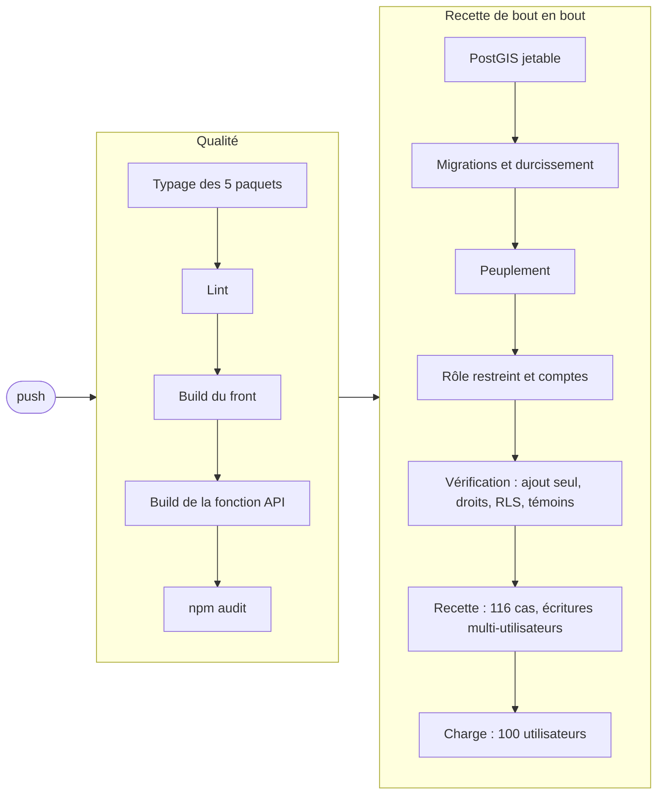
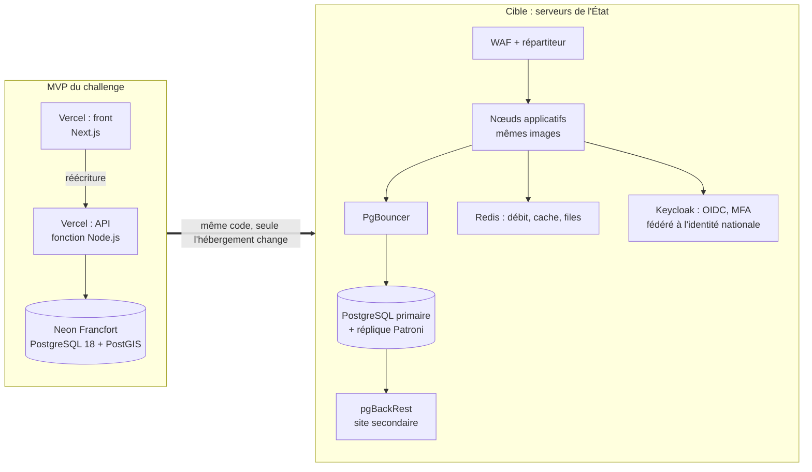

<div align="center">

# BEILE

**Bénin Education Intelligence & Learning Ecosystem**

Plateforme nationale interopérable de parcours et d'intelligence éducatifs

*Chaque parcours suivi. Chaque décision éclairée.*

**En ligne : [edu-tech-api-rho.vercel.app](https://edu-tech-api-rho.vercel.app)** · API : [beile-api.vercel.app/api/v1/sante](https://beile-api.vercel.app/api/v1/sante) · hébergement Vercel `fra1` + Neon Francfort

    

</div>

---

## Sommaire

1. [Le projet](#1-le-projet)
2. [Les espaces et leurs utilisateurs](#2-les-espaces-et-leurs-utilisateurs)
3. [Architecture d'ensemble](#3-architecture-densemble)
4. [Architecture logicielle](#4-architecture-logicielle)
5. [Le cycle d'un fait : écrire une fois, restituer partout](#5-le-cycle-dun-fait--écrire-une-fois-restituer-partout)
6. [Modèle de données](#6-modèle-de-données)
7. [Sécurité et protection des données](#7-sécurité-et-protection-des-données)
8. [Tenue en charge à l'échelle nationale](#8-tenue-en-charge-à-léchelle-nationale)
9. [Qualité et intégration continue](#9-qualité-et-intégration-continue)
10. [Déploiement : MVP et cible souveraine](#10-déploiement--mvp-et-cible-souveraine)
11. [Démarrer en local](#11-démarrer-en-local)
12. [Documentation](#12-documentation)

---

## 1. Le projet

Le système éducatif béninois produit chaque jour des faits : une inscription, une absence, une note, un transfert, un diplôme.
Aujourd'hui ces faits sont dispersés entre établissements, directions et systèmes (EducMaster, examens, état civil). Ils sont
ressaisis plusieurs fois et remontent tard, souvent incomplets.

**BEILE relie ces faits en un registre unique et restitue à chaque acteur ce dont il a besoin, et rien de plus.**

| Principe | Traduction concrète |
|---|---|
| **Un fait saisi une fois** | L'absence saisie par l'enseignant devient notification pour la famille, ligne du jour pour la direction, taux pour l'inspection et couleur sur la carte nationale, sans aucune ressaisie. |
| **Rien n'est effacé** | Le registre est en *ajout seul*, garanti par la base elle-même. Une erreur se corrige par un événement correctif motivé, et l'original reste tracé. |
| **Identité ancrée au registre national** | Chaque apprenant est rattaché à son NPI. L'enfant sans acte de naissance est inscrit, signalé et régularisé : jamais exclu. |
| **Chaque accès est décidé, puis journalisé** | Quatre critères sont examinés (rôle, périmètre, relation, finalité), côté serveur. Les refus sont journalisés au même titre que les accès. |
| **L'IA n'invente jamais un chiffre** | *Ask Education* traduit une question en requête structurée. C'est le moteur sémantique qui calcule, et la source ainsi que l'indice de confiance sont affichés. |
| **Souverain par construction** | Ce sont des briques libres et standard (PostgreSQL, Node.js). Le même code tourne sur Vercel et Neon pour le MVP, puis sur les serveurs de l'État. |

---

## 2. Les espaces et leurs utilisateurs

Chaque utilisateur se connecte avec son compte nominatif, et l'espace s'ouvre selon ses habilitations.



| Espace | Ce que l'utilisateur fait réellement |
|---|---|
| **Cockpit national** | Chiffres clés avec indice de confiance, carte des 77 communes, zones prioritaires expliquées par leurs facteurs, flux des faits du jour en direct |
| **Console territoriale** | Indicateurs sous périmètre, établissements retardataires, absences du jour par établissement, relances de transmission |
| **Établissement** | Tableau du jour (absences en direct, alertes de décrochage), inscription par NPI ou sans acte, transferts, délibération et diplômes vérifiables |
| **Enseignant** | Appel en quelques secondes, **y compris hors connexion**, saisie et correction motivée des notes, formation continue |
| **Famille / Apprenant** | Notes, absences, justification, notifications, passeport éducatif continu malgré les transferts, diplômes à QR code |
| **Conformité** | Journal de toutes les décisions d'accès (accordées et refusées), statistiques des refus, registre des traitements |
| **Administration** | Création d'utilisateurs aux habilitations vérifiées (rôle ↔ périmètre ↔ registre NPI), révocation de sessions, file d'assistance, publication du calendrier scolaire |
| **Assistance** | Tout utilisateur ouvre une demande depuis son menu et suit les réponses ; l'administration la traite et la résout |
| **Services publics** | Annuaire des 11 700 établissements (recherche, carte, « autour de moi »), calendrier scolaire officiel dynamique, démarches d'inscription (y compris sans acte de naissance), données ouvertes par département, vérification de diplôme, centre d'aide |
| **Guides** | Visite guidée animée dans chaque espace (démarre à la première visite), centre d'aide `/aide` et [guides écrits par profil](docs/guides/README.md) |

---

## 3. Architecture d'ensemble

Front et back sont **deux déploiements distincts**. Le navigateur ne connaît qu'une origine : Next.js réécrit `/api/v1/*` vers
l'API. Les cookies de session sont donc *first-party* (HttpOnly), la politique de sécurité du contenu (CSP) ne comporte aucune
origine tierce, et aucune ouverture CORS n'est nécessaire.



---

## 4. Architecture logicielle

Le dépôt est un **monorepo npm workspaces**. Le front ne contient aucune logique d'accès aux données. Les contrats de données
(schémas zod) sont partagés par le front, l'API et la base : ils constituent la seule interface entre les couches.



```text
apps/
  web/                 Next.js 16 : pages par espace, coquilles, composants, client HTTP, session
  api/                 Hono : routes, sécurité, écriture au registre, lectures agrégées, recette, test de charge
packages/
  contracts/           Contrats zod : événements, personnes, accès, sémantique, certification
  simulation/          Moteurs métier purs et testables (le nom est historique : ils servent en production)
  db/                  Schéma, migrations Drizzle, durcissement (ajout seul, RLS, rôles), comptes, projections
docs/                  Infrastructure, sécurité, déploiement, dimensionnement, charte, conventions du front
.github/workflows/     Intégration continue : qualité + recette de bout en bout sur base jetable
```

---

## 5. Le cycle d'un fait : écrire une fois, restituer partout

Voici le parcours complet d'une absence saisie par un enseignant, tel qu'il est vérifié par la recette automatisée.



Ce même fait nourrit ensuite le taux d'absence de la console territoriale et le flux du cockpit national.
**Une saisie, quatre restitutions.**

---

## 6. Modèle de données

La base est organisée en schémas PostgreSQL, un par nature de données et par règle de protection.



| Schéma | Contenu | Règle |
|---|---|---|
| `ledger` | Registre des événements éducatifs | **Ajout seul** : UPDATE, DELETE et TRUNCATE sont refusés par déclencheur |
| `core` | Personnes, établissements, comptes, sessions, **projections** (`scolarites`, `notes`) | Projections tenues dans la transaction d'écriture, reconstructibles à tout moment depuis le registre |
| `audit` | Journal des décisions d'accès | Ajout seul |
| `analytics` | Cube statistique national, sans donnée nominative | Lecture pour la couche sémantique |
| `workflow` | Modèles de circuit, demandes, décisions | Décisions en ajout seul |
| `sensible` | Cas de protection, besoins particuliers | **RLS forcée**, fermé par défaut |
| `registre_simule` | Registre national des personnes (simulé en attendant le raccordement ANIP) | Lecture seule |

L'API se connecte avec le rôle `beile_api`, membre de `beile_app`. Ce rôle n'a ni `BYPASSRLS` ni droit d'effacer : même
compromise, l'API ne peut ni réécrire l'histoire ni lire le compartiment sensible.

---

## 7. Sécurité et protection des données

La défense est organisée en couches successives, chacune indépendante des autres.



- **Mots de passe** : scrypt (N=2¹⁵, r=8), mot de passe initial à changer obligatoirement, réinitialisation par l'administrateur avec affichage unique.
- **Sessions** : seule l'empreinte SHA-256 du jeton est stockée ; la déconnexion révoque côté serveur ; un changement de mot de passe ferme les autres sessions.
- **Audit** : chaque décision d'accès à une donnée individuelle est tracée, et les refus le sont systématiquement. Les consultations identiques répétées sont regroupées par fenêtre de 10 minutes.
- **Données personnelles** : minimisation par espace, finalité déclarée à chaque accès, registre des traitements consultable par le DPO.

Détails, menaces et liste de contrôle avant production : [docs/SECURITE.md](docs/SECURITE.md).

---

## 8. Tenue en charge à l'échelle nationale

Choix d'architecture **mesurés**, pas estimés (voir [docs/DIMENSIONNEMENT.md](docs/DIMENSIONNEMENT.md)) :

- **CQRS** : les écrans lisent des projections indexées et des agrégats calculés dans PostgreSQL. On ne rapatrie jamais le registre brut.
- **API sans état** : sessions en base avec un cache de 30 s par instance. Ajouter des instances ne demande aucune coordination.
- **Cube national en mémoire** : chargé une seule fois même sous charge (*single-flight*), rafraîchi en arrière-plan, calculs mémoïsés par périmètre.
- **Limitation de débit à deux niveaux** : un établissement entier peut partager une même IP publique (NAT) sans être bloqué.

| Mesure | Avant optimisation | Après |
|---|---|---|
| Console territoriale, 20 requêtes simultanées | 7,9 s | **0,27 s** |
| Cockpit national, 20 requêtes simultanées | 3,0 s | **0,48 s** |
| 40 requêtes concurrentes de 4 profils différents (même base) | 3,9 s | **0,72 s** |
| Agrégat SQL « bilans » de 300 élèves, en base | — | **4 ms** |
| Écrans en production depuis Porto-Novo (tableau d'établissement, élèves, famille) | — | **≈ 300 ms** |
| Équivalence des résultats avec le moteur de référence | — | **0 écart** sur 293 élèves |

---

## 9. Qualité et intégration continue

À **chaque push**, la CI reconstruit tout sur une base PostgreSQL + PostGIS **jetable**. Elle n'utilise aucun secret ni aucune donnée de production.



- **Recette** : 116 cas avec de vrais comptes, dont les refus attendus (hors périmètre, sans relation, CSRF manquant, origine étrangère, habilitation incohérente, demande d'assistance d'un tiers), les services publics et le calendrier.
- **Contrôle visuel** : chaque profil, chaque page, dans un vrai navigateur à 360 px et à 1440 px. Résultat : 68 vérifications conformes sur 68, sans débordement, sans erreur console et sans écran d'erreur.
- Branches : `feature/*` → `dev` → `staging` → `main`, uniquement par pull request.

---

## 10. Déploiement : MVP et cible souveraine



Guide pas à pas : [docs/DEPLOIEMENT.md](docs/DEPLOIEMENT.md). Architecture cible et migration : [docs/INFRASTRUCTURE.md](docs/INFRASTRUCTURE.md).

---

## 11. Démarrer en local

Prérequis : Node.js 22 et une base PostgreSQL avec PostGIS (Neon, ou un conteneur local).

```bash
npm install

# Base : migrations, peuplement, rôle de l'API, comptes, projections, vérification
npm run migrer -w @beile/db
npm run peupler -w @beile/db
npm run role-api -w @beile/db       # écrit DATABASE_URL_API dans .env
npm run comptes -w @beile/db        # mots de passe générés dans COMPTES.local.md (ignoré par Git)
npm run projections -w @beile/db
npm run calendrier -w @beile/db     # calendrier scolaire officiel (arrêté du 28 juillet 2026)
npm run verifier -w @beile/db
# ou, tout en une fois sur une base existante (IRRÉVERSIBLE, l'hôte doit être recopié) :
# npm run reinitialiser -w @beile/db <hôte de la base>

# Services
npm run dev:api                     # API : http://localhost:4000/api/v1/sante
npm run dev                         # Front : http://localhost:3000 (BEILE_API_INTERNE, par défaut :4000)

# Contrôles
npm run typecheck && npm run lint
npm run recette -w @beile/api       # lecture et refus : sans risque sur une base partagée
npm run guides:docs -w @beile/web   # régénère docs/guides depuis le centre d'aide
```

Une base jetable complète s'obtient avec un conteneur `postgis/postgis:18-3.6` : voir [docs/DIMENSIONNEMENT.md §4](docs/DIMENSIONNEMENT.md).

---

## 12. Documentation

| Document | Contenu |
|---|---|
| [INFRASTRUCTURE.md](docs/INFRASTRUCTURE.md) | MVP, cible souveraine, garanties d'Ask Education, migration |
| [SECURITE.md](docs/SECURITE.md) | Mesures en place, architecture cible, menaces, contrôles avant production |
| [DEPLOIEMENT.md](docs/DEPLOIEMENT.md) | Neon, deux projets Vercel, CI, recette |
| [DIMENSIONNEMENT.md](docs/DIMENSIONNEMENT.md) | Mesures de performance et ordres de grandeur |
| [REGISTRE_COUVERTURE.md](docs/REGISTRE_COUVERTURE.md) | Les cinq couches, les dix moteurs, le registre des processus |
| [CHARTE_GRAPHIQUE.md](docs/design/CHARTE_GRAPHIQUE.md) | Charte fondée sur les plateformes de l'État |
| [Guides des utilisateurs](docs/guides/README.md) | Un guide par profil (11) : premiers pas, écrans, tâches pas à pas, FAQ — aussi en ligne sur `/aide`, avec une visite guidée animée dans chaque espace |
| [FRONT_CONVENTIONS.md](docs/FRONT_CONVENTIONS.md) | Règles des interfaces : états, adaptatif, animations, disposition |

---

### À propos des données

- **Le registre, les comptes, les notes, les absences et les inscriptions sont réellement écrits en base** par les utilisateurs de la plateforme.
- Les personnes (apprenants, familles, personnels) sont **fictives**. Aucune donnée personnelle réelle n'est utilisée ni hébergée.
- Les **statistiques nationales** (77 communes, environ 11 700 établissements) proviennent d'un jeu généré au peuplement, en attendant
  le raccordement aux remontées officielles. L'interface l'indique dans la provenance de chaque indicateur.

Limites administratives : geoBoundaries. Photographies : Pexels (crédits dans `apps/web/public/images/CREDITS.md`).

<div align="center">

<sub>République du Bénin · BEILE · plateforme proposée pour le challenge national</sub>

</div>
